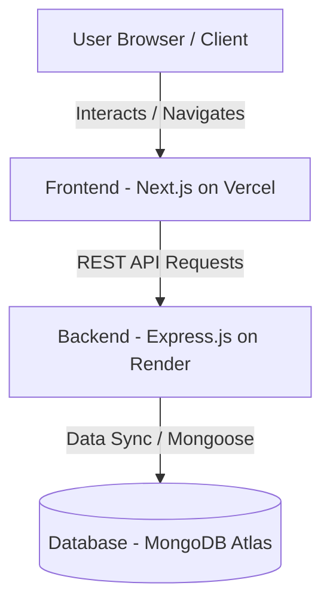
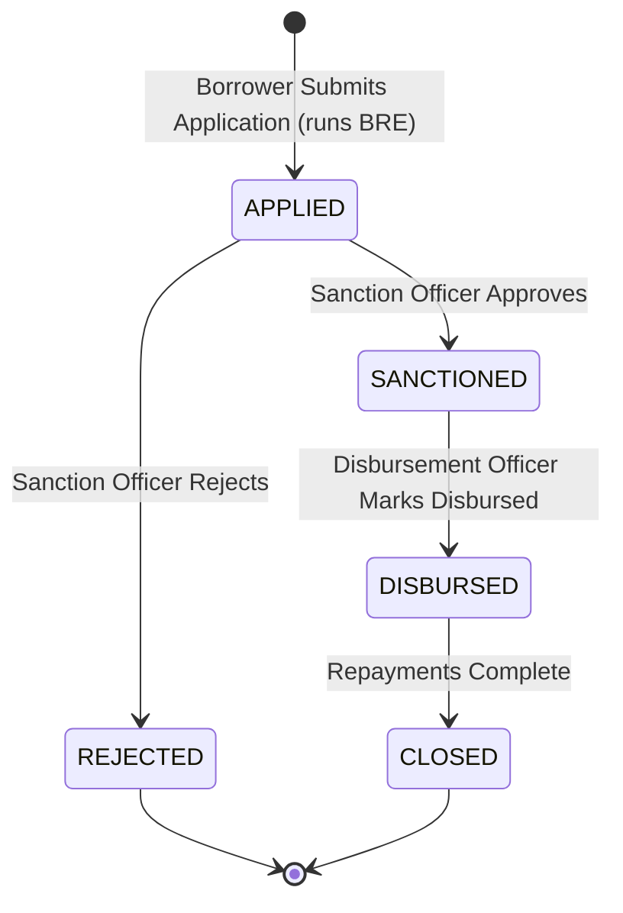
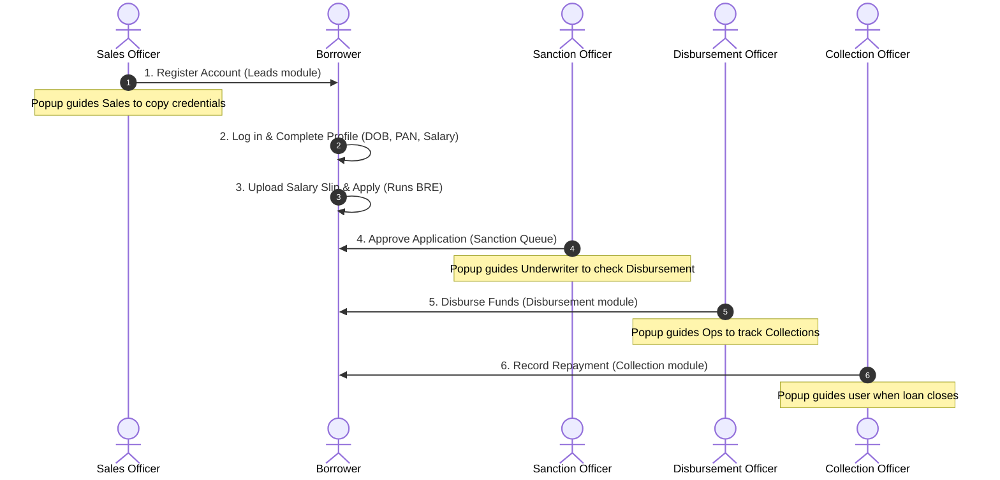

# Loan Management System (LMS)

A full-stack Loan Management System with a Borrower Portal and an Internal Operations Dashboard, built with Next.js, Express, TypeScript, and MongoDB.


## Tech Stack

| Layer     | Technology                              |
|-----------|-----------------------------------------|
| Frontend  | Next.js 15 (App Router), TypeScript, Tailwind CSS |
| Backend   | Node.js, Express.js, TypeScript         |
| Database  | MongoDB with Mongoose                   |
| Auth      | JWT + bcrypt                            |
| Uploads   | Multer (PDF/JPG/PNG, max 5 MB)          |

---

## Prerequisites

- Node.js ≥ 18
- MongoDB running locally on `mongodb://localhost:27017` (or update `.env`)
- npm

---

## Quick Start

### 1. Clone / Navigate to repo

```bash
cd LoanManagementSystem
```

### 2. Backend setup

```bash
cd backend
cp .env.example .env      # Edit MONGO_URI and JWT_SECRET if needed
npm install
npm run seed              # Creates demo accounts
npm run dev               # Starts on http://localhost:5000
```

### 3. Frontend setup (in a new terminal)

```bash
cd frontend
cp .env.example .env.local
npm install
npm run dev               # Starts on http://localhost:3000
```

---

## Demo Accounts (created by seed script)

| Role         | Email                    | Password      |
|-------------|--------------------------|---------------|
| **Admin**    | admin@lms.com            | Admin@123     |
| **Sales**    | sales@lms.com            | Sales@123     |
| **Sanction** | sanction@lms.com         | Sanction@123  |
| **Disbursement** | disbursement@lms.com | Disburse@123  |
| **Collection** | collection@lms.com     | Collect@123   |
| **Borrower** | borrower@lms.com         | Borrower@123  |

> **Tip:** The login page has one-click fill buttons for all demo accounts.

---

## User Flows

### Borrower Flow
1. Sign up at `/signup` (or use seeded borrower account)
2. Complete profile: Full Name, PAN, DOB, Salary, Employment Mode
3. Upload salary slip (PDF/JPG/PNG ≤ 5 MB)
4. Configure loan amount (₹50K–₹5L) and tenure (30–365 days)
5. Click Apply → BRE runs server-side
6. View application status on the same page

### Operations Flow
- **Admin** → can access all 4 modules via nav
- **Sales** → `/dashboard/sales` — sees registered borrowers who haven't applied
- **Sanction** → `/dashboard/sanction` — approve or reject APPLIED loans
- **Disbursement** → `/dashboard/disbursement` — mark SANCTIONED loans as disbursed
- **Collection** → `/dashboard/collection` — record payments with UTR; loan auto-closes when fully repaid

---

## Business Rules Engine (BRE)

All checks run **server-side** before creating a loan application:

| Rule | Condition |
|------|-----------|
| Age | 23 ≤ age ≤ 50 |
| Salary | ≥ ₹25,000/month |
| PAN | Matches `[A-Z]{5}[0-9]{4}[A-Z]` |
| Employment | Not Unemployed |

---

## Interest Calculation

```
SI = (P × R × T) / (365 × 100)
Total Repayment = P + SI
```

- R = 12% p.a. (fixed)
- T = Tenure in days
- Live preview shown before submitting

---

## System Diagrams

### 1. System Architecture


### 2. Loan Lifecycle State Transitions


### 3. End-to-End Guided Operations Pipeline


---

## Cloud Deployment (Production)

This project is fully ready for deployment on modern cloud platforms.

### 1. Database (MongoDB Atlas)
1. Sign up/log in to [MongoDB Atlas](https://www.mongodb.com/cloud/atlas).
2. Provision a **M0 Free Cluster**.
3. Under **Network Access**, add `0.0.0.0/0` to allow database access from Render.
4. Under **Database Access**, create a user and copy the connection string. Replace `<username>` and `<password>` inside the connection URL.

### 2. Backend (Render)
* **Build Command**: `npm install && npm run build`
* **Start Command**: `npm run start`
* **Required Environment Variables**:
  * `MONGO_URI`: Your MongoDB Atlas connection link.
  * `PORT`: `10000` (Render's default port).
  * `JWT_SECRET`: A secure key for signing web tokens.
  * `FRONTEND_URL`: URL of your deployed Vercel frontend.

### 3. Frontend (Vercel)
* **Build Command**: `npm run build`
* **Output Directory**: `.next`
* **Required Environment Variables**:
  * `NEXT_PUBLIC_API_URL`: The URL of your deployed Render backend API.

---

## API Endpoints

| Method | Path | Auth | Description |
|--------|------|------|-------------|
| POST | `/api/auth/signup` | — | Register borrower |
| POST | `/api/auth/login` | — | Login |
| GET | `/api/auth/me` | Any | Current user |
| GET | `/api/borrower/profile` | borrower | Get profile |
| PUT | `/api/borrower/profile` | borrower | Update profile |
| POST | `/api/borrower/upload-salary-slip` | borrower | Upload file |
| POST | `/api/borrower/apply` | borrower | Apply for loan |
| GET | `/api/borrower/application` | borrower | My loan status |
| GET | `/api/dashboard/sales` | admin, sales | Leads |
| GET | `/api/dashboard/sanction` | admin, sanction | Applied loans |
| PUT | `/api/dashboard/sanction/:id` | admin, sanction | Approve/reject |
| GET | `/api/dashboard/disbursement` | admin, disbursement | Sanctioned loans |
| PUT | `/api/dashboard/disbursement/:id` | admin, disbursement | Mark disbursed |
| GET | `/api/dashboard/collection` | admin, collection | Disbursed loans |
| POST | `/api/dashboard/collection/:id/payment` | admin, collection | Record payment |

---

## Project Structure

```
LoanManagementSystem/
├── backend/
│   └── src/
│       ├── config/          # DB connection
│       ├── controllers/     # authController, borrowerController, dashboardController
│       ├── middleware/       # auth (JWT), RBAC, upload, errorHandler
│       ├── models/          # User, LoanApplication, Payment
│       ├── routes/          # auth, borrower, dashboard
│       ├── services/        # BRE, loanCalculator
│       ├── types/           # Shared TS types
│       ├── index.ts         # Entry point
│       └── seed.ts          # Demo data seeder
└── frontend/
    ├── app/
    │   ├── (auth)/login/    # Login page
    │   ├── (auth)/signup/   # Signup page
    │   ├── apply/           # Borrower 4-step flow
    │   └── dashboard/       # Sales, Sanction, Disbursement, Collection
    ├── components/
    │   ├── ui/              # Button, Input, Select, StatusBadge
    │   └── DashboardNav.tsx
    ├── lib/
    │   ├── api.ts           # Typed API client
    │   └── auth-context.tsx # Auth state (Context + localStorage)
    └── types/               # Shared TS types
```

---

## Security Notes

- Passwords hashed with bcrypt (salt rounds: 10)
- All ops routes protected with JWT + role check at API level
- RBAC enforced both in frontend routing and backend middleware
- UTR uniqueness enforced via MongoDB unique index
- File type validated via MIME type + extension
